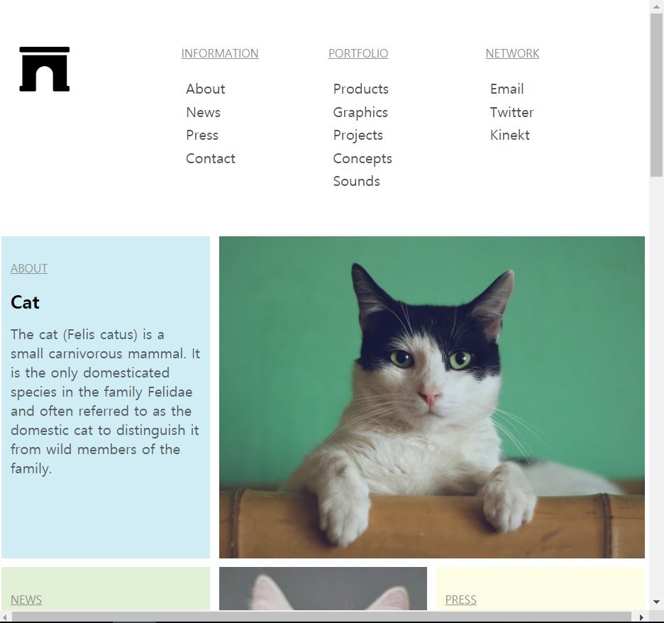
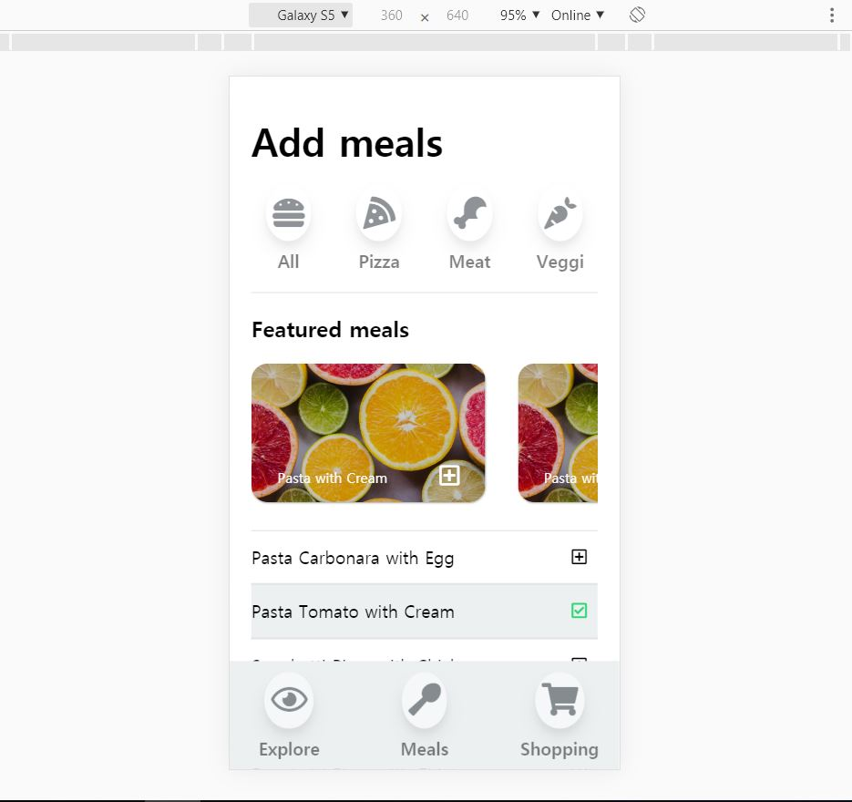
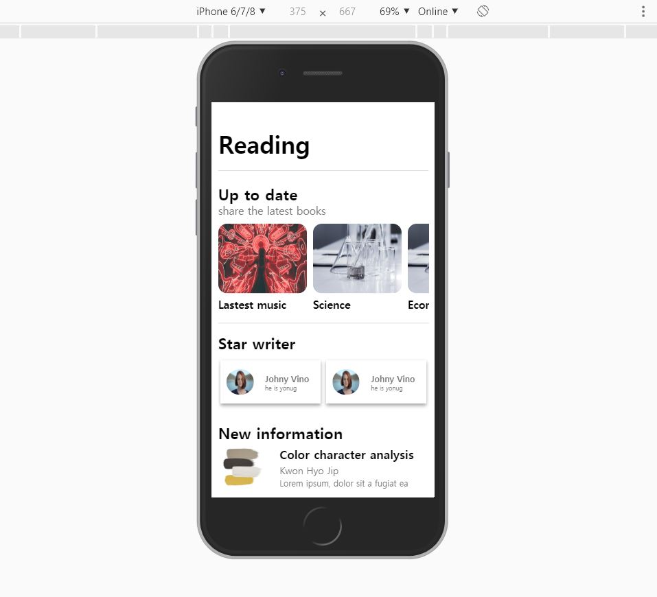
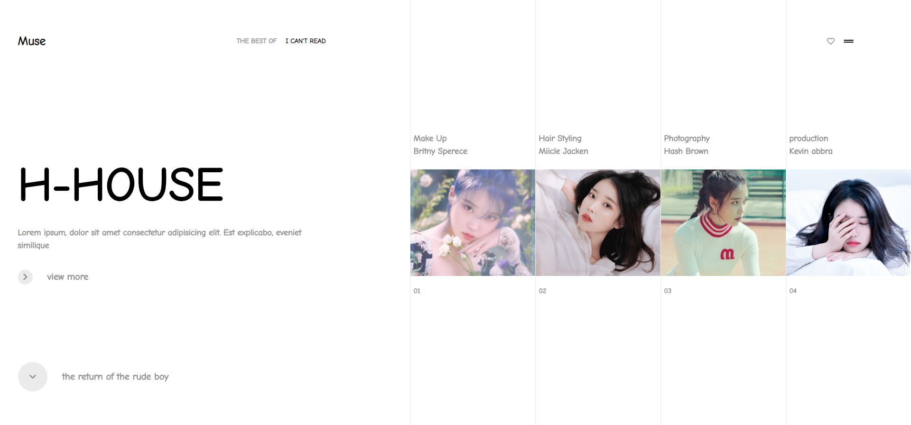

# CSS

### HTML과 CSS를 사용해 직접 만듬
### parcel과 Grid, Flex template 배움

## project1

## project2

## project3

## project4

## project5

## project6

## project7

## project8

## project9

## project10

## project11

## project12

## project13

## project14

## project15

